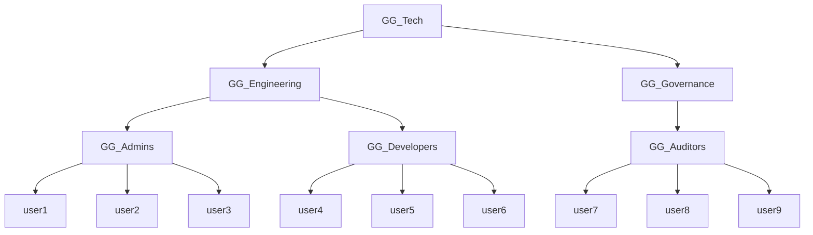
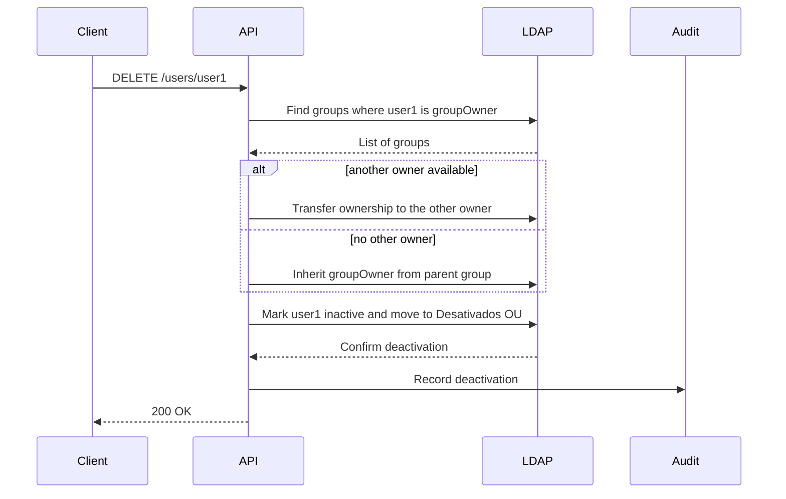
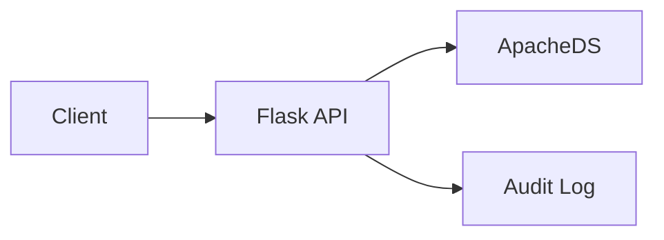
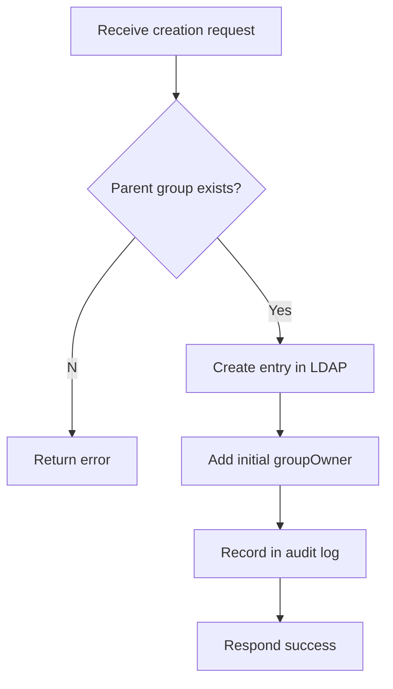

# Architecture

## Group and User Hierarchy

```mermaid
graph TD
    GG_Tech["GG_Tech"]
    GG_Engineering["GG_Engineering"]
    GG_Governance["GG_Governance"]
    GG_Tech --> GG_Engineering
    GG_Tech --> GG_Governance
    GG_Engineering --> GG_Admins["GG_Admins"]
    GG_Engineering --> GG_Developers["GG_Developers"]
    GG_Governance --> GG_Auditors["GG_Auditors"]
    GG_Admins --> user1["user1"]
    GG_Admins --> user2["user2"]
    GG_Admins --> user3["user3"]
    GG_Developers --> user4["user4"]
    GG_Developers --> user5["user5"]
    GG_Developers --> user6["user6"]
    GG_Auditors --> user7["user7"]
    GG_Auditors --> user8["user8"]
    GG_Auditors --> user9["user9"]
```

## Group owner deletion flow

```mermaid
sequenceDiagram
    participant Client
    participant API
    participant LDAP
    participant Audit

    Client->>API: DELETE /users/user1
    API->>LDAP: Find groups where user1 is groupOwner
    LDAP-->>API: List of groups
    alt another owner available
        API->>LDAP: Transfer ownership to the other owner
    else no other owner
        API->>LDAP: Inherit groupOwner from parent group
    end
    API->>LDAP: Mark user1 inactive and move to Desativados OU
    LDAP-->>API: Confirm deactivation
    API->>Audit: Record deactivation
    API-->>Client: 200 OK
```

## Additional diagrams

### Component view

```mermaid
graph LR
    Client --> API["Flask API"]
    API --> LDAP["ApacheDS"]
    API --> Audit["Audit Log"]
```

### Group creation flow

```mermaid
flowchart TD
    A[Receive creation request] --> B{Parent group exists?}
    B --No--> C[Return error]
    B --Yes--> D[Create entry in LDAP]
    D --> E[Add initial groupOwner]
    E --> F[Record in audit log]
    F --> G[Respond success]
```

